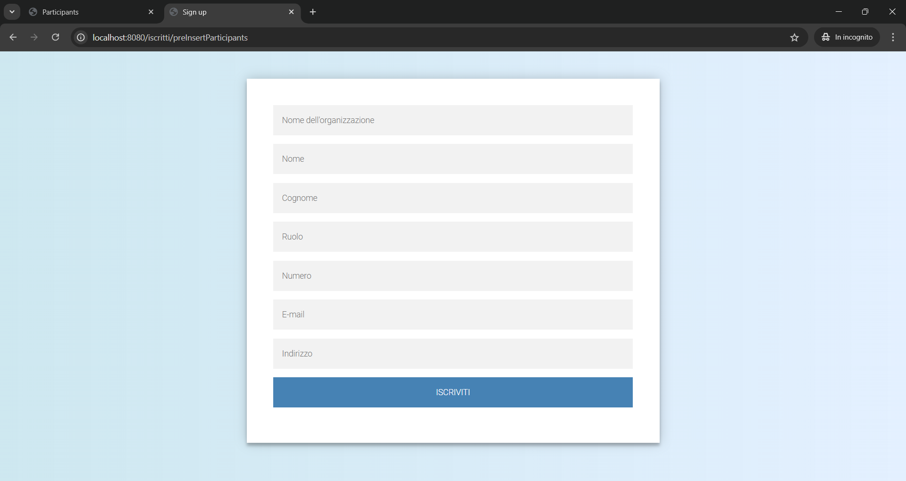
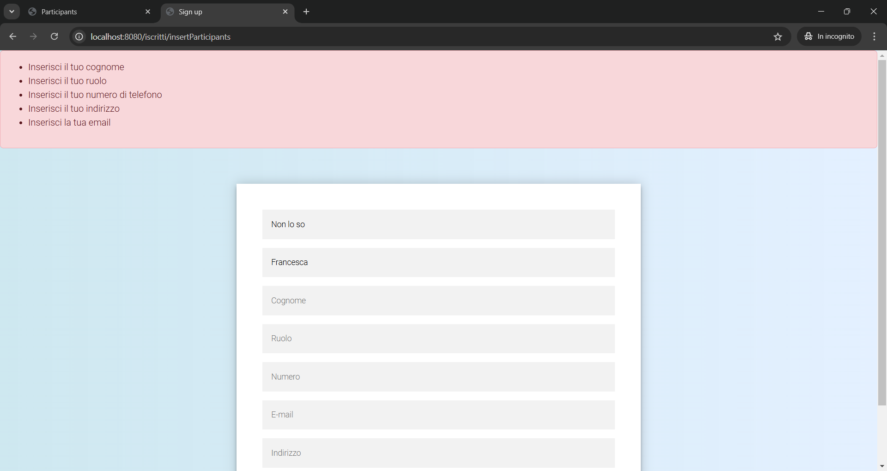
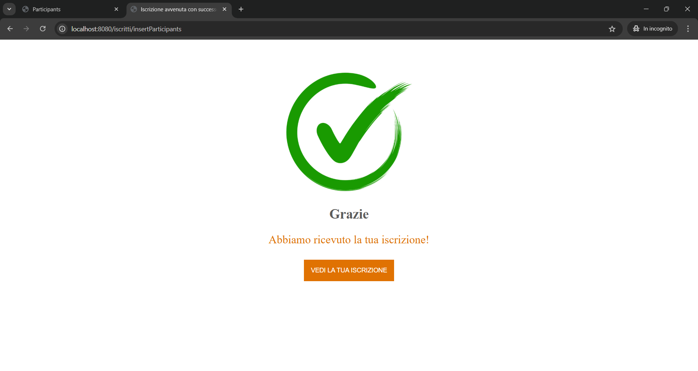
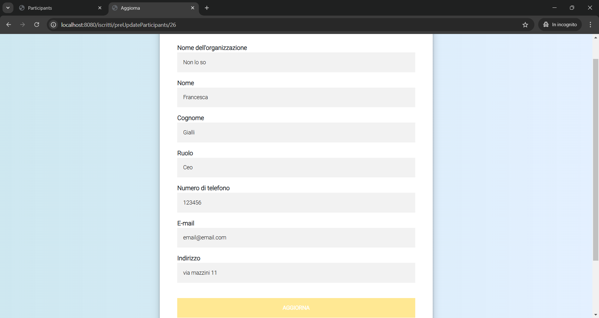
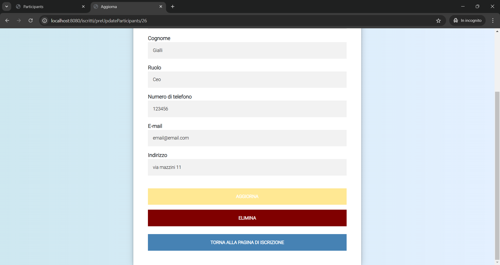
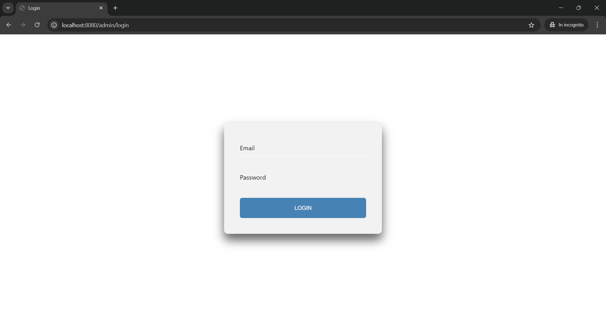
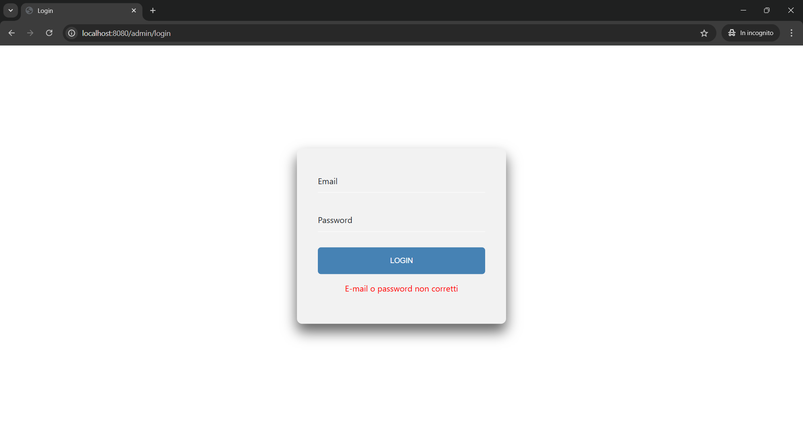
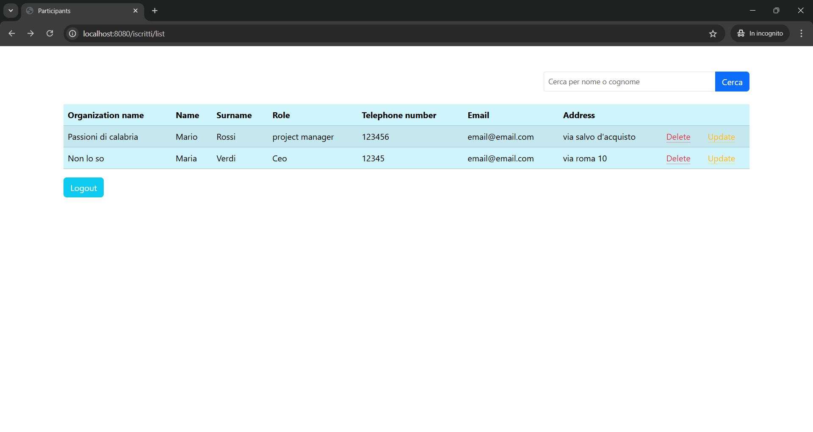
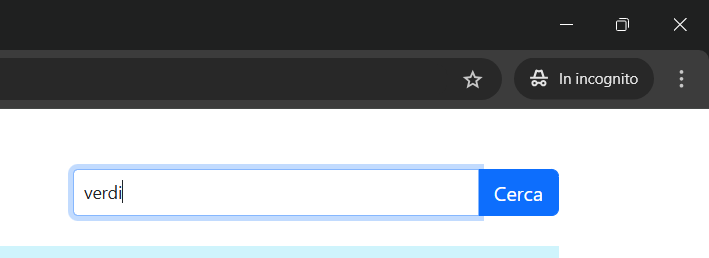
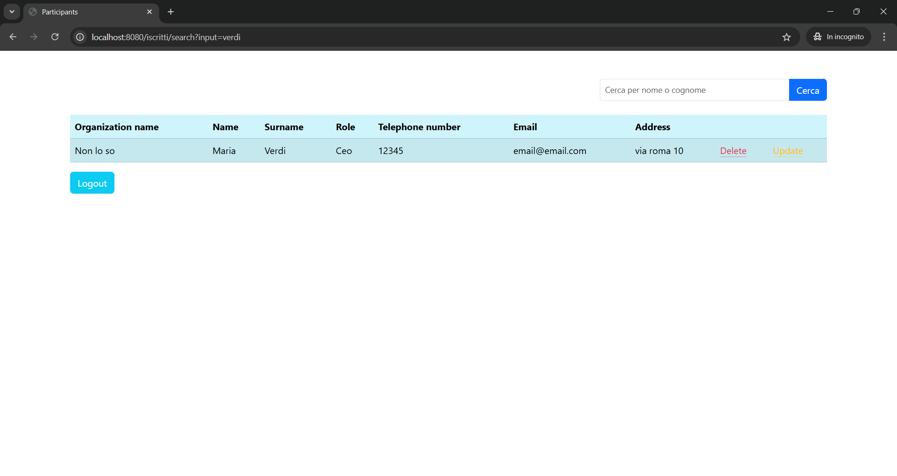

# Gestionale convegni

Questo progetto tratta un'app di un gestionale di convegni

## Descrizione

Questa app tratta di un gestionale di convegni, la persona interessata al convegno si può iscrivere. Una volta iscritto può modificare o eliminare la sua iscrizione. L'amministratore invece, una volta fatto il login con le sue credenziali, può vedere tutte le persone che si sono iscritte, modificarle o eliminarle e cercare una persona per nome. L'app è stata realizzata con diverse tecnologie: spring, java, spring security, jpa, Bootstrap,html, css, sql, javascript

## Funzionalità

L'app include le seguenti funzionalità:

- collegamento al database
- login animato
- password criptate
- sito responsive per smartphone e tablet

## Tecnologie utilizzate

L'app è stato sviluppato utilizzando le seguenti tecnologie:
- spring
- java
- jpa
- sql
- spring security
- HTML
- Bootstrap
- CSS
- javascript

## Licenza

<!-- Questo progetto è stato rilasciato sotto la licenza MIT. Per ulteriori informazioni, leggere il file `LICENSE.md`. -->

## Crediti

Questo progetto è stato sviluppato da Katia Falletti.(https://it.linkedin.com/in/katia-falletti-616890225?trk=people-guest_people_search-card)
